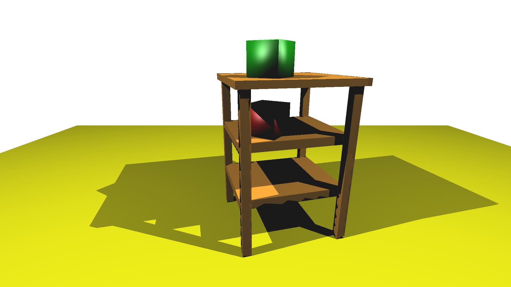
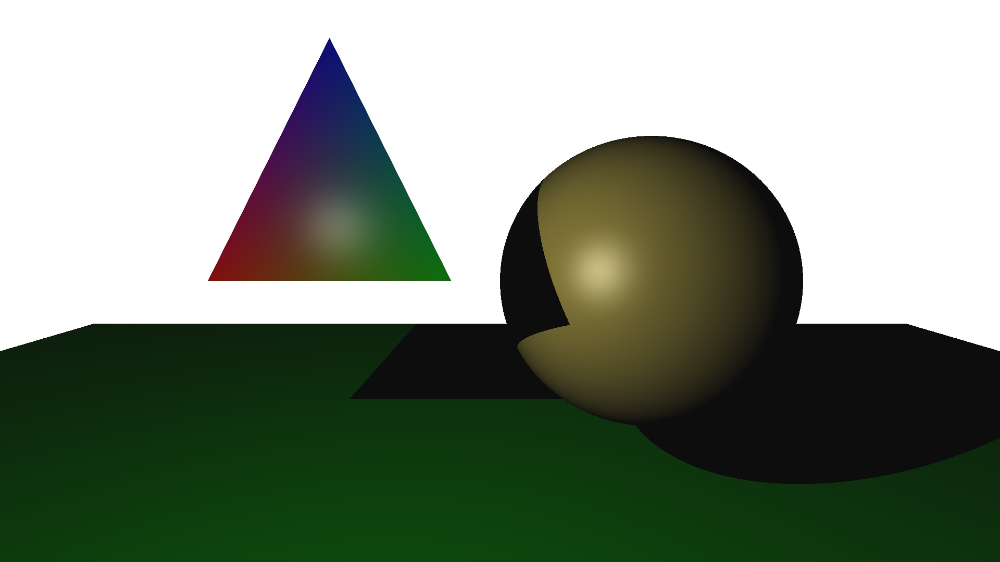

## Raytracer - Adit Bhartia

This is a raytracer I made as part of my final project for my Computer Graphics class. It supports drawing triangles and spheres, shadow rays, phong shading, and multiple light sources.

To run: 

```
cd src/
make
./raytracer ../path/to/input/scene/file [optional jpeg to save to]
```

The output resolution is currently set to 1920x1080 as defined at the beginning of `raytracer.cpp`. You can reduce the resolution for a faster experience.

Example input scene files and the corresponding output images are in the test and out directories respectively. 

Input scene file format: 

```
# of objects
amb: r g b
[sphere/triangle]
pos: xpos ypos zpos
nor: xpos ypos zpos
dif: r g b
spe: r g b
shi: val
...
light
pos: xpos ypos zpos
col: r g b
...
```

Example output images (rendered at 1920x1080):

 
 
